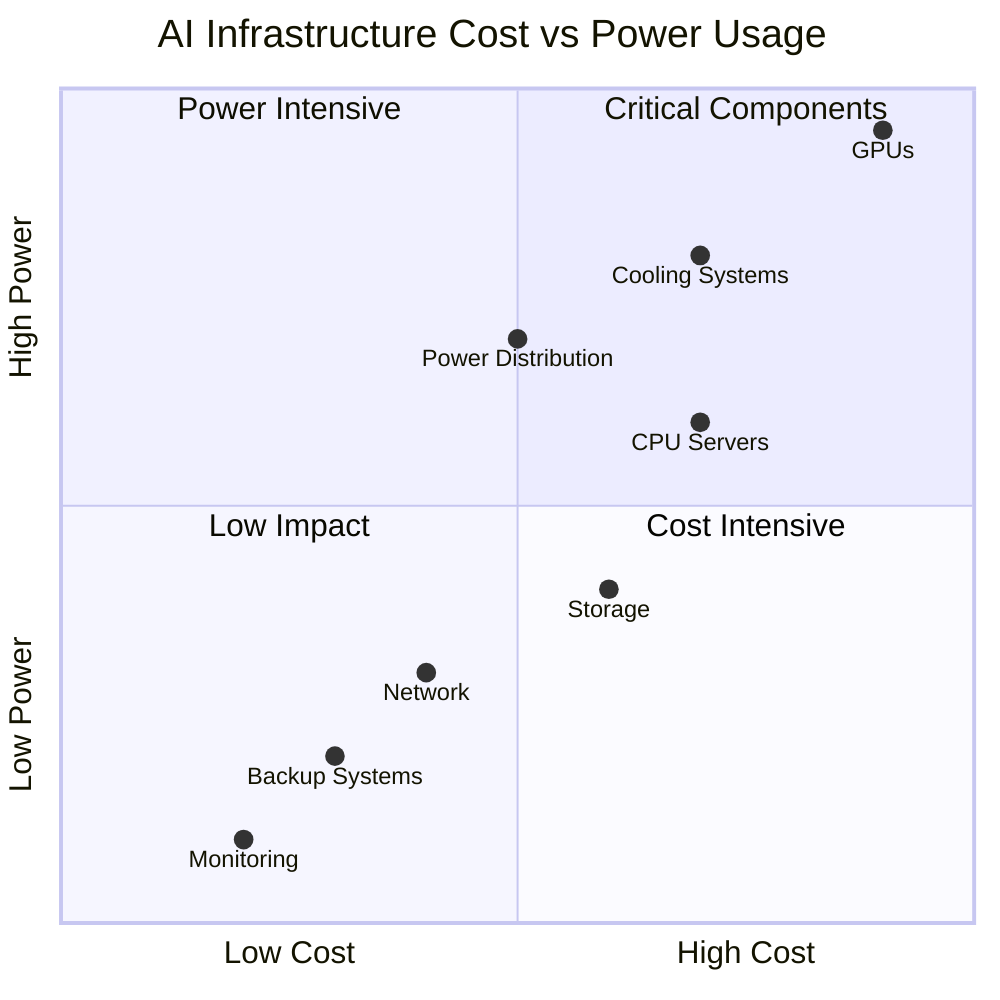
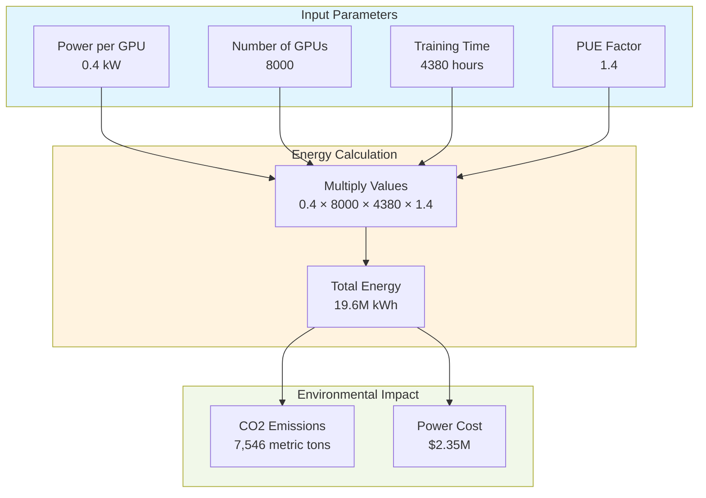

## README.md

At this point, this will hurt. 

A potential crisis of hardware designers where a remake towards the blueprint of computer chips is higly nessecary and to make them atleast 3x more energy efficient to train the ML models that are in used today.
Since OpenAI dont give a shit about enviromental changes, and yes AI wont "fix" climate change since by all means the energy demand for AI will only increase even if rest of the world tries to build larger power systems.

While i was looking at all the datasets in [HuggingFace](https://huggingface.co/datasets), i then understood the issue primarily due to the way they are accessed, processed, and used in model training. Needs to store large datasets on its servers, which requires energy for cooling, maintaining hardware, and data redundancy.
I wanted to understand this now even more and see what the potential crisis could affect engineers but also for the current path of AI developement.

## High Volume Compute and Energy Costs

The SOTA models used today (GPT-4, Llama, Claude) requires insane amount of computational resources which translates into energy consumption and expensive infrastructure



### Critical Components (Q1)
- **GPUs**: Dominating both cost and power usage, high-end NVIDIA A100s consume up to 400W each while costing ~$10,000 per unit
- **Cooling Systems**: Essential for maintaining GPU operations, typically consuming 30-40% of total infrastructure power

### Power Intensive (Q2)
- **Power Distribution**: Requires significant energy for conversion and distribution
- **CPU Servers**: Supporting compute infrastructure with moderate cost but substantial power needs

### Low Impact (Q3)
- **Network Infrastructure**: Relatively efficient with moderate costs
- **Monitoring Systems**: Essential but minimal resource impact
- **Backup Systems**: Periodic high usage but generally low consumption

### Cost Intensive (Q4)
- **Storage Systems**: High initial investment but moderate power usage
- **Redundancy Systems**: Expensive to implement but energy efficient

## Dataset Size on Training Time and Model Efficiency

Whilst larger and more intesive datasets may be an improvement for the models accuracy and decrease the risk of missinformation, in some sense where the model becomes delusional.
Training on larger datasets leads to longer training times (1+1=2) which in turn increase the energy usage for the prolonged operation of each compute resource.
This is where most machine learning engineers needs to fully focus on the codebase, the reason for that is becuse IF datasets are not efficietnly handeled (using batch tequniques or caching), the training can extend time and energy consumption + cost increase.

In the same category, there is an impact of `re-training with updated datasets`.
If a dataset is frequently updated or new versions are released, models need to be retrained or fine tuned as they usually say it. This can add extra energy usage especially for larger models that require multiple iterations of retraining.

To simply breakdown the consumpation calculation of training a model like GPT-4o:

### Basic Formula
```math
E_{total} = P_{gpu} × N_{gpu} × T_{training} × (1 + PUE)
```
* $E_{total}$ = Total energy consumption (kWh)
* $P_{gpu}$ = Power per GPU (kW)
* $N_{gpu}$ = Number of GPUs
* $T_{training}$ = Training time (hours)
* $PUE$ = Power Usage Effectiveness (typically 1.1-1.6)

To convert the math into a real world example at the scale of GPT-4o:



To make this even more fun and understand how bad this really is i made some comprisons...
### Carbon Footprint Context
The 7,546 metric tons of CO2 emissions equals:
- 1,640 passenger vehicles driven for one year
- Carbon sequestered by 8,900 acres of forest
- Annual emissions from 900 homes' electricity use

This scale of current energy consumption highlights the need of more efficient training methods and renewable energy sources in modern AI infrastructure, since each AI company today gets created within a week of development and is always in a startup scale the understanding of scaling will become very hard.

